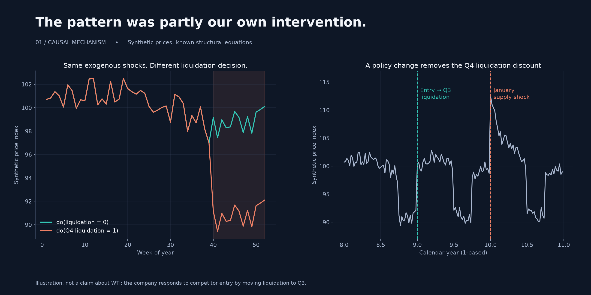
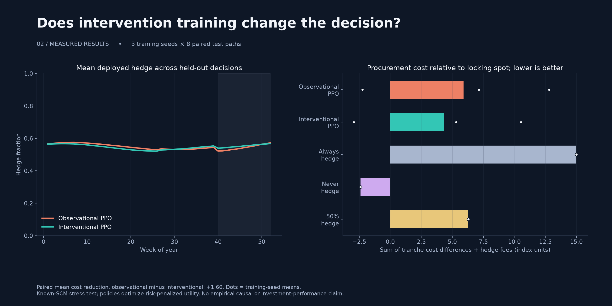
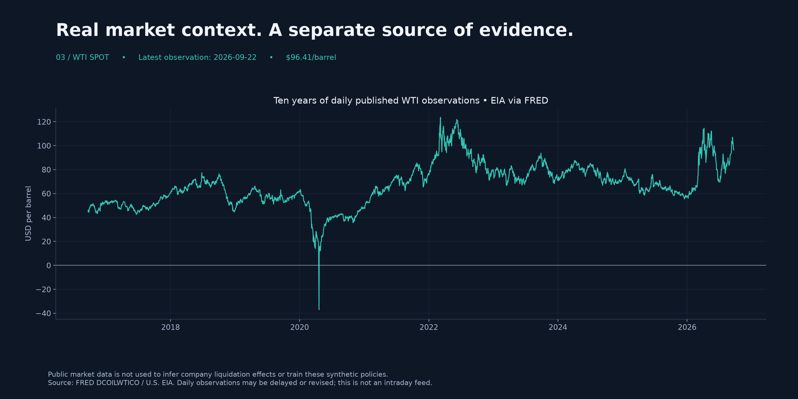

# Causal AI · Commodity Hedging

**When the pattern you learn is the policy you used.**

A Transformer-PPO policy observes a recurring Q4 price discount. Part of that pattern comes from the company's own liquidation schedule. When the company changes its schedule after competitor entry, the discount disappears. This repository tests what changes when the policy trains on explicit liquidation interventions.



> **Scope:** reproducible synthetic procurement experiment with a known SCM. Real WTI prices are included as market context, not as evidence that a company caused seasonality. Causal effects are assumed in the simulator, not discovered from the public data.

## Start with the notebook

**[Read the complete experiment in one Jupyter notebook](Causal_AI_Experiment.ipynb)** — explanations, full model code, executed training, data tables and inline figures, in one place. All outputs are saved, so GitHub can render the findings without running code. The notebook does not import the local package; its model definitions are synchronized with the tested implementation.

```bash
pip install -e '.[notebook]'
jupyter lab Causal_AI_Experiment.ipynb
```

Choose **Restart Kernel → Run All** to reproduce all six training runs. Generated results go into `notebook-runs/`, separate from the committed reference results. WTI data stays in `data/`; a standalone notebook can download it from FRED. [Download the notebook](https://github.com/sandipdikshit/Causal-AI/raw/refs/heads/main/Causal_AI_Experiment.ipynb).

The notebook is the guided reading and presentation format; the package and tests support reuse and maintenance. Neither structure needs to replace the other.

## Run it

Python 3.11+; CPU is sufficient. From the repository root:

```bash
python -m venv .venv
source .venv/bin/activate        # Windows: .venv\Scripts\activate
pip install -e '.[dev]'
pytest -q
causal-hedging demo             # 3 seeds × 4,096 steps per policy × 8 test paths
python -m http.server 8000 --directory docs
```

Open **http://localhost:8000** for the visual demo. You can also open `docs/index.html` directly: the report and its intervention slider work offline. Committed figures and results let you demo immediately without retraining. Runtime depends on hardware; the 104-token attention model is intentionally small.

```bash
causal-hedging fetch            # refresh public daily WTI observations, no API key
causal-hedging render           # rebuild visuals from saved results + market data
causal-hedging demo --steps 64 --seeds 42 --test-paths 1  # smoke test, not a benchmark
```

For the exact direct dependency versions used in the reference run, install `pip install -r requirements-reference.txt` before the editable package. Floating compatible dependencies remain the default for portability; cross-platform floating-point results may differ. Optional Node.js 22+ verifies the offline slider with `node --test tests/test_demo.mjs`.

The CLI writes paths relative to the working directory and overwrites the corresponding generated results. Run it from a copy of the repository if you want to preserve the committed reference run. `fetch` fails visibly on download errors; it never fabricates observations or silently substitutes synthetic prices.

## The experiment

| Component | Implementation |
|---|---|
| Data-generating process | Ten synthetic years, 52 weeks per year |
| Information at each decision | 104 weekly prices + cyclical week features; no future prices |
| Model | One Transformer encoder layer, 2 attention heads, 16-dimensional embeddings |
| Policy | PPO over hedge fractions 0%, 25%, 50%, 75%, 100%; no clipped Gaussian likelihoods |
| Exposure | Independent four-week future procurement tranches; hedging locks today's spot-price proxy |
| Observational training | First eight years under the company's historical Q4 liquidation policy |
| Interventional training | Same exogenous historical path; episode-level interventions: observed, none, Q3, Q4 |
| Holdout | Calendar years 9–10; company responds to entrant by liquidating in Q3; January year-10 supply shock |
| Evaluation | Same eight unseen noise paths for both policies and three fixed-hedge baselines, across three training seeds |

A two-year warmup leaves training decisions in years 2–8; every four-week training target is strictly before year 9. Rollouts continue across PPO minibatches instead of resetting the timeline. No held-out shock is used in training. The stress parameters are designed, not inferred from WTI.

### Structural equations and interventions

```text
P_t = 100 + 1.5 sin(2π week_t / 52) + U_t − 8 L_t + S_t
U_t ~ Normal(0, 0.7²)
L_t = Q4 before entry; Q3 after entry
S_t = 12 exp(−elapsed / 8) from January of year 10; 0 before
```

The cosine/sine seasonal component is deterministic. `U_t` is stochastic noise. Replacing `L_t` with zero or a Q4 schedule implements an intervention. Paired paths use identical `U_t` and `S_t`, so their price difference isolates the known liquidation effect.

This is **interventional simulation under an assumed SCM**, not an implementation of a causal-identification algorithm or learned causal discovery. The interventional agent receives extra structural knowledge through its training worlds. The post-entry liquidation rule is a company response to competitor entry; the competitor does not directly buy or sell in the price equation.

### Economic objective

For hedge fraction `h` and horizon `H = 4`:

```text
cost_t    = (1 − h) × (P_(t+H) − P_t) + 0.15 h
utility_t = −cost_t − 0.04 max(cost_t, 0)²
```

A positive cost is worse than locking all volume at today's spot before fees. Policies maximize risk-penalized utility (scaled by 10 for training). Reported cost is in synthetic index units, not dollars or investment returns. Overlapping weekly tranches represent distinct procurement commitments; this is not one self-financing trading portfolio.

Evaluation deploys the probability-weighted **mean hedge**, while training samples categorical actions. The saved `p_under_half` is the exact probability of an action below 50%; it is distinct from the deployed mean. No 94% probability is assumed or targeted. No futures basis, margin, financing or endogenous hedge impact is modeled.

## Measured results



The committed reference run produced:

| Policy | Mean cost ↓ | Mean risk-penalized utility ↑ | Mean worst-tranche cost ↓ |
|---|---:|---:|---:|
| Observational PPO | 5.90 | −14.91 | 5.64 |
| Interventional PPO | 4.30 | −13.31 | 5.61 |
| Always hedge | 15.00 | −15.09 | 0.15 |
| Never hedge | −2.40 | −39.82 | 12.63 |
| 50% hedge | 6.30 | −17.26 | 6.39 |

The paired mean cost reduction is **1.60 index units**. All three seed-level reductions were positive (1.84, 2.28, 0.68), but absolute learned-policy costs varied substantially across seeds. The unhedged baseline has the lowest raw cost and the worst risk-penalized utility. This is a modest result under a specified stress, not universal superiority.

See [`results/summary.csv`](results/summary.csv) for cost, utility, worst-tranche cost and mean hedge; [`results/metrics.json`](results/metrics.json) records every training seed and paired cost difference. White dots in the chart are training-seed means across shared test paths. Variation over three seeds is descriptive, not a confidence interval or proof of generalization.

The outcome is not forced to favor interventional training. A known causal simulator permits better-defined questions; it does not guarantee a better policy, compensate for inadequate optimization, or protect against every unseen supply shock. Always-hedged and unhedged baselines remain essential.

## Real market data



[`data/provenance.json`](data/provenance.json) records source, retrieval time, observation range and CSV SHA-256. Data comes from [FRED DCOILWTICO](https://fred.stlouisfed.org/series/DCOILWTICO), sourced from U.S. EIA. The fetch command retains the latest ten years of valid daily observations, including historically negative prices. It is a **published daily series**, not a real-time exchange feed. Recent observations may be delayed or revised. This is a retrieval-time snapshot, not vintage-aware data.

No private company liquidation records are available, so these observations do not identify the effect of liquidation. The real series is not used to fit, normalize or train the synthetic experiment. Source terms and attribution remain applicable to downloaded data; the code license does not relicense third-party data.

## Repository map

```text
Causal_AI_Experiment.ipynb  Full executed experiment in one notebook
scripts/build_notebook.py  Synchronizes inline implementation with package source
src/causal_hedging/  SCM, PPO, paired evaluation, data access, visuals, CLI
tests/              interventions, no leakage, PPO shapes, GAE, parsing, smoke training
docs/index.html     offline demo with interactive intervention slider
docs/assets/        shareable PNG + SVG figures
results/            full reference-run metrics, training logs and evaluation rows
data/               WTI snapshot and provenance
```

## What changed from the original sketch

- Real liquidation interventions replace initial-history noise and reward offsets.
- All likelihoods have matching one-dimensional shapes; categorical actions need no clipping.
- Dropout is disabled; inference is deterministic; trajectory continuity and terminal bootstrapping are explicit.
- 104-step histories, chronological boundaries and identical evaluation paths are tested.
- Price forecasting, causal discovery and a 94% under-hedging result are not claimed.

## References

- [PPO clipped objective and implementation guidance](https://spinningup.openai.com/en/latest/algorithms/ppo.html)
- [Pearl: A Causal Calculus for Statistical Research](https://proceedings.mlr.press/r0/pearl95a.html)
- [EIA spot-price data](https://www.eia.gov/dnav/pet/pet_pri_spt_s1_d.htm)
